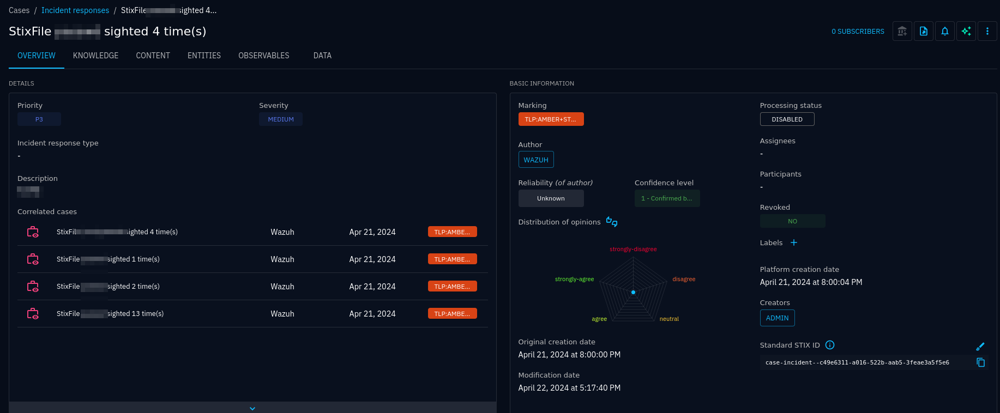
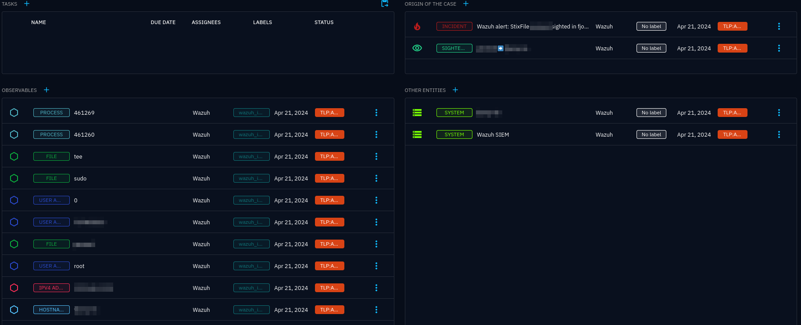
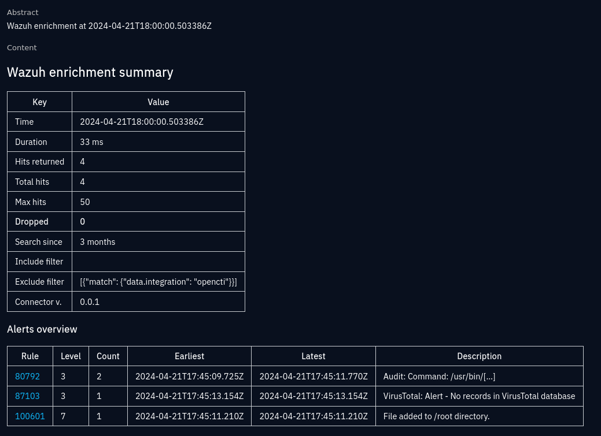
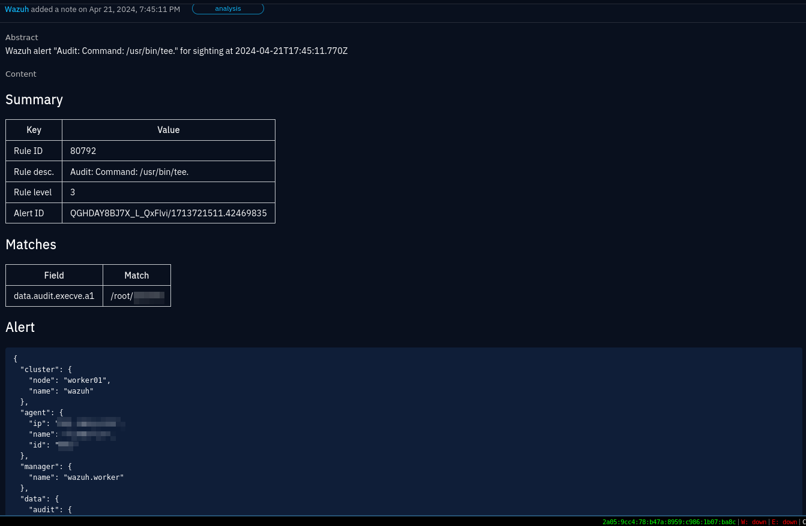

# OpenCTI–Wazuh-connector

opencti-wazuh-connector is an [OpenCTI
connector](https://docs.opencti.io/latest/deployment/connectors/) that lets you
look up entities from your cyber threat database in your Wazuh SIEM. It's
implemented as an
[*enrichment*](https://docs.opencti.io/latest/deployment/connectors/#enrichment)
connector, which triggers automatically (or manually if you want) whenever a
new entity is added to the OpenCTI database.

This connector has several use cases. Perhaps the most obvious one is to
automatically scan your whole SIEM database whenever there is a new indicator
imported in OpenCTI. However, it can also act as a comfortable search
interface, automatically creating sightings for you for every hit.

See the [extensive
documentation](https://misje.github.io/opencti-wazuh-connector/) for information
about installation, configuration and usage.

> [!CAUTION]
> opencti-wazuh-connector is in an **early alpha stage**. Although the
> connector does not make any changes to Wazuh, it may produce a lot of data in
> OpenCTI. **Do not use the connector yet in production**.

## Overview

The connector performs its work in the following defined stages:

### Inspect

This stage looks at the incoming entity, determines whether it should be looked
up according to the thresholds in the settings (TLP allowed, is an indicator
required, is it a private IP address, does it have a label in the ignore list).
If the entity should be looked up in Wazuh, the connector proceeds.

### Search

The search stage constructs an OpenSearch query that will look for the entity's
metadata in a number of fields. How the query is formed, varies depending on
the entity type and search settings. For instance, if the entity is a StixFile,
the resulting query may look for one or more of the observable's hashes. If
just a name is provided, a search for the filename (including its path, if
provided), is performed. If the File has a size defined, the size may be
included as a search parameter. Any filename aliases may be included too.

For a User-Account, the search may either for the account_login, user_id or
both. For a Process object, the command_line can be looked up in known command
line fields, with wildcard support and ignoring argument order.

Whether you want specific and targeted searches, or searches that look for
partial matches, is entirely up to you through the plethora of options. Most
observables, as well as some entities, like Vulnerability, are supported.

### Events

The next stage is deciding what to do with the results. The first step is to
create
[sightings](https://docs.opencti.io/latest/usage/exploring-events/#sightings),
which indicates that an observable was "sighted" in a system (a Wazuh agent,
AWS, GitHub, Office 365 or the SIEM itself). A sighting contains information
about when the observation was first made, the time of the last observation,
and the number of observations in this time frame.

### Enrich

In order to provide useful context for the events created later, the enrichment
stage tries to extract all possible information from alerts as STIX cyber
observables. For instance, if an alert includes information about a process, a
Process SCO (STIX cyber observable) is created. The process may also include a
parent process as an individual, referenced, Process SCO, and references to the
commands ran as File SCOs. Additionally, any network traffic is represented as
Network-Traffic. And so on, including pretty much all SCOs, as well as
Attack-Pattern (Wazuh's MITRE data).

Enrichment is performed if an incident is created.

### Incidents and cases

Depending on your settings, the sighting may be the cause of an
[incident](https://docs.opencti.io/latest/usage/exploring-events/#incidents).
An incident typically indicates something serious, like if a "sighted"
observable is part of an indicator. Incidents would typically create a
notification of some sort for you to act on.

You may choose how incidents are created. Either never, per sighting, per
distinct alert rule ID, per alert or per query.

An [incident response
case](https://docs.opencti.io/latest/usage/exploring-cases/#incident-response-request-for-information-request-for-takedown)
is optionally created for an incident. Cases help visualise incidents by
providing a graph of all entities involved, starting from the entitiy the
connector was run on, sightings, incidents and enriched entities.

## Screenshots

