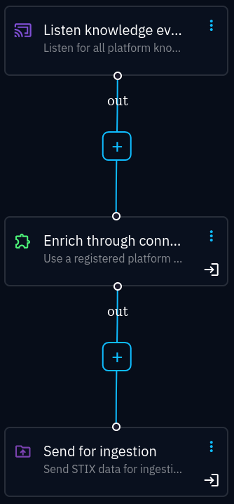

Configuration
===================================================

The connector has a plethora of configuration options, allowing for detailed
customisation in searching and enrichment. There are some settings you
:ref:`have to <required_settings>` set (there are no defaults, like
usernames and passwords), and there are some settings you :ref:`should
<important_settings>` read about, since they greatly affect the behaviour of
the connector.

.. _required_settings:

Required settings
~~~~~~~~~~~~~~~~~

All required settings are marked *[Required]* in the complete configuration
documentation.

- OPENCTI_URL
- OPENCTI_TOKEN
- CONNECTOR_ID
- CONNECTOR_NAME=Wazuh
- CONNECTOR_SCOPE
- CONNECTOR_AUTO=true
- :attr:`OpenSearch URL <wazuh.opensearch_config.OpenSearchConfig.url>`
- :attr:`OpenSearch username <wazuh.opensearch_config.OpenSearchConfig.username>`
- :attr:`OpenSearch password <wazuh.opensearch_config.OpenSearchConfig.password>`
- :attr:`Wazuh URL <wazuh.config.Config.app_url>`
- :attr:`Max TLP <wazuh.config.Config.max_tlp>`

The following scopes are supported by the connector (read more in the :ref:`alert search <alert_search>` section):

- Artifact
- Directory
- Domain-Name
- Email-Addr
- Hostname
- IPv4-Addr
- IPv6-Addr
- Mac-Addr
- Network-Traffic
- Process
- Software
- StixFile
- Url
- User-Account
- User-Agent
- Windows-Registry-Key
- Windows-Registry-Value-Type
- Vulnerability
- Indicator

.. _important_settings:

Important settings
~~~~~~~~~~~~~~~~~~

After having configured the required settings, you should at minimum read up on
and adjust the following settings:

TLS verification
----------------

FIXME: replace with first-time cert import?:

- :attr:`Verify OpenSearch TLS certificate <wazuh.opensearch_config.OpenSearchConfig.verify_tls>`

Searching
---------

:attr:`search.limit <wazuh.opensearch_config.OpenSearchConfig.limit>`

   Maximum number of alerts to return from a search

:attr:`~wazuh.config.Config.hits_abort_limit`

   Number of alert matches (reported by OpenSearch, not the number of results
   returned) that should abort further processing. This limit helps preventing
   flooding OpenCTI with events from bad searches. See also
   :attr:`~wazuh.config.Config.bundle_abort_limit`.

Event creation
--------------

:attr:`~wazuh.config.Config.create_obs_sightings`

   Create sightings for observables that do not have indicators based on them

.. _require-indicator:

:attr:`~wazuh.config.Config.require_indicator_for_incidents`

   By default, incidents (and incident response cases) will only be created if
   observables have indicators based on them. These additional settings are
   used to adjust the indicator requirements:

   - :attr:`~wazuh.config.Config.require_indicator_detection`
   - :attr:`~wazuh.config.Config.ignore_revoked_indicators`
   - :attr:`~wazuh.config.Config.indicator_score_threshold`

:attr:`enrich.types <wazuh.enrich_config.EnrichmentConfig.types>`

   Which entites to create as alert context for incidents. By default, all
   supported entities are enabled, which may be noisy (depending on the alert
   matched).

When to run
-----------

The CONNECTOR_AUTO setting can be either *auto* or *manual*. Auto is most
likely the most preferred choice. However, it is possible to use
:octiu:`playbooks <automation>` to run :octiu:`enrichments
<automation/?h=enrich#enrich-through-connector>` if you have an OpenCTI
enterprice licence. In the example below, the opencti-wazuh-connector is
configured as *manual*, and called through a playbook. The first block is set
to filter on author, so that the connector will only look entities from
high-quality data sources:

See `this Filigran blog post
<https://blog.filigran.io/introducing-threat-intelligence-automation-and-playbooks-in-opencti-b9e2f9483aba>`_
for an introduction on playbooks.

cti conf. opensearch, api, tlp conf. etc.

- search config
- conf for creating sightings
- for incidents
- incident response

Other considerations
~~~~~~~~~~~~~~~~~~~~

.. toctree::
   :hidden:

   rules_engine

Look at how your OpenCTI :ref:`rules engine <rules-engine>`
is configured in order to avoid any surprises.

Configuration reference
~~~~~~~~~~~~~~~~~~~~~~~

Main configuration
------------------

.. automodule:: wazuh.config
   :members:

OpenSearch configuration
------------------------

.. automodule:: wazuh.opensearch_config
   :members:

Search configuration
--------------------

Look at :ref:`the alert search topic <alert_search>` for details.

.. automodule:: wazuh.search_config
   :members:

Enrichment configuration
------------------------

Look at :ref:`the enrichment topic <enrichment>` for details.

.. autopydantic_settings:: wazuh.enrich_config.EnrichmentConfig
   :settings-show-json-error-strategy: coerce

Wazuh API configuration
-----------------------

Wazuh API is only partially supported.

.. automodule:: wazuh.wazuh_api_config
   :members:
