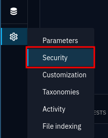
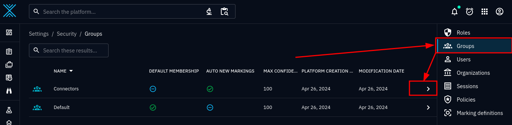
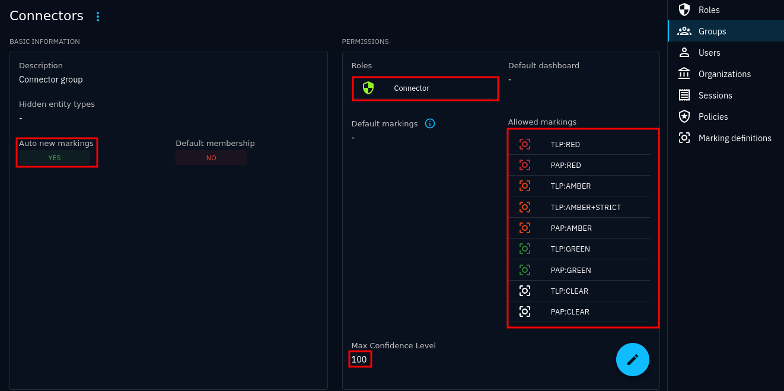
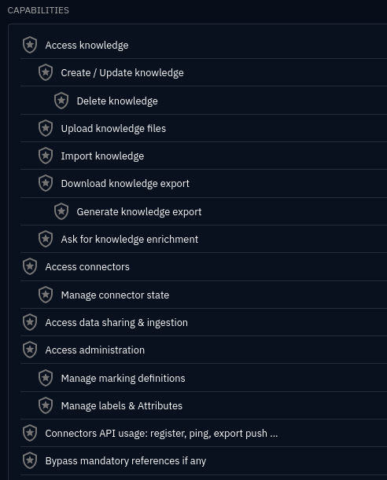
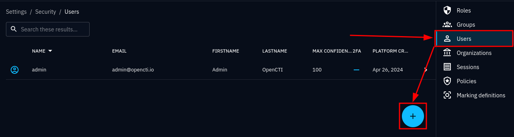
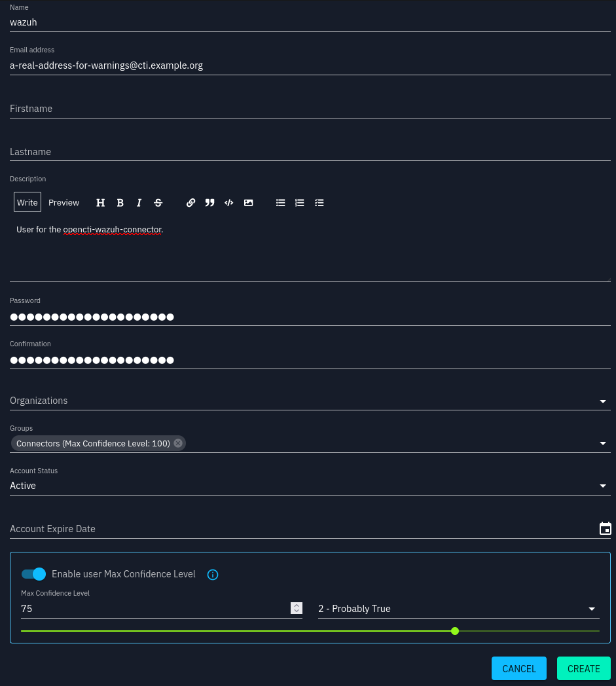
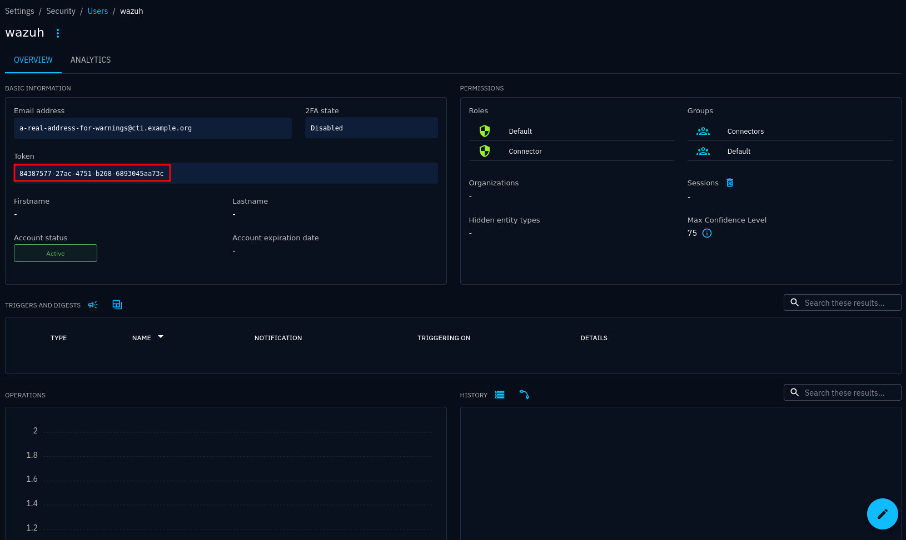

.. _create-opencti-user:

Creating an OpenCTI user
========================

Although you may have found plenty of docker-compose examples where connectors
are run as the OpenCTI admin user, this is not at all encouraged. – Not just
because the connector should not be run with administrator privileges on the
platform, but because starting with OpenCTI version 6, maximum confidence level
is no longer specified in the connector config, but per user/group. This
breaking change is explain `here
<https://blog.filigran.io/breaking-change-evolution-of-the-way-connector-streams-and-feeds-import-data-in-opencti-d10d7eb4407e>`_.

Maximum confidence
~~~~~~~~~~~~~~~~~~

What is confidence, what is maximum confidence, and why is it important? Please
visit the :octiu:`OpenCTI docs on the topic <reliability-confidence>` for
detailed information, especially the section about :octiu:`max confidence
<reliability-confidence/?h=max+confi#max-confidence-level>`.

The confidence level you set for the user/group that the connector will run as,
determine the trustworthiness of the data it produces, and consequently,
whether it is allowed to update/replace data that already exists.

What you configure as the resulting max confidence level for the connector user
is up to you, as it really depends on how you use your platform.

Creating a user
~~~~~~~~~~~~~~~

First, go to the *Security section*:

   
   *Security* is found by navigating to the bottom of the navigation tab and
   selecting *Security*.

Before creating a user, we will be either creating a group or selecting a
suitable group that already exists, after inspecting it.

   
   This OpenCTI installation already contains a *Connectors* group, which we
   will inspect.

   
   Overview of the selected *Connectors* group.

The *Connectors* group have the following properties already configured for us:

- It has the *Roles* "Connector" (which we will inspect shortly)
- It has all the platform's *Allowed markings*, giving it access to all data in
  the platform. We cannot lower this at user-level, as with max confidence, but
  we can entrust the connector to ignore disallowed :term:`TLP` markings by
  configuring :attr:`~wazuh.config.Config.max_tlp` accordingly.
- The group will be given access to all future marking definitions, since *Auto
  new markings* is set to true.
- *Max confidence level* is set to maximum. We can lower this at user-level, if
  needed.

Let's inspect the *Connector* role by clicking on it:

   Role permissions overview for the *Connector* role

We are not going to spend too much time understanding all the different
permissions assigned to this role, as we trust OpenCTI to have given us all
that is needed for a typical connector. If you need to assign permissions
yourself, use this as a reference.

Navigate to the *Users* view and create a new user:

   User list

Create a new user:

- Choose a descriptive username
- Add a real e-mail address (an OpenCTI requirement)
- Enter a passphrase (which may be set-and-forget, as we will only use a token
  with this account, and never log in). Choose a complex passphrase.
- Select the *Connectors* group, or in case you have made your own group,
  select that one.
- Consider setting a lower max confidence level than the maximum. This prevents
  the connector from overwriting properties in entities that are set by
  analysts and sources whom you trust more.

   Create new user interface

Click on the user after it has been created and copy the token:

   User overview

Put the token in the :attr:`OPENCTI_TOKEN
<wazuh.opencti_config.OpenCTIConfig.token>` variable.

Also have a look at :octid:`OpenCTI documentation
<connectors/?h=connector+toke#connector-token>` for possibly more up-to-date
information about creating users for connectors.

.. note::

      You do not *have* to use groups for assigning roles and max confidence
      levels, but it makes administration easier.

.. note::

      If you do not want to give the connector access to confidential data in
      the platform, you should consider creating a new group and adjust the
      *allowed markings* for that group. Alternatively, just use the
      :attr:`~wazuh.config.Config.max_tlp` setting.
