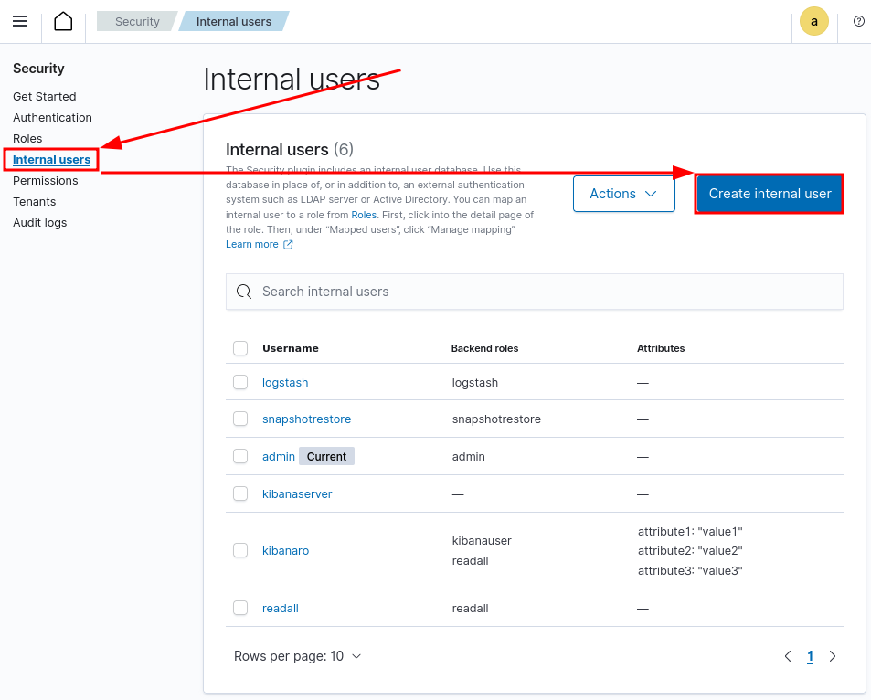

.. _create-opensearch-user:

Creating an OpenSearch user
===================================================

The connector needs to connect to Wazuh's OpenSearch instance in order to
search alerts. Wazuh's :wazuh:`own API <api>` is not the same as OpenSearch's,
and does not provide a way to query alerts.

The Wazuh web interface is an OpenSearch dashboard, with a Wazuh app. You'll
therefore see two places to configure users and roles. You'll need to create an
*OpenSearch user*, and not a Wazuh user. Navigate to the OpenSearch
**Security** section:

Then navigate to **Internal users** and click on the **Create internal user**
button.

#. Enter a descriptive username
#. Choose a passphrase (pick a complex passphrase)
#. Repeat the chosen passphrase
#. Select **readall** as backend role
#. Click **Create**

That's it! Copy

- the username to :attr:`search.username
  <wazuh.opensearch_config.OpenSearchConfig.username>` and
- the password to :attr:`search.password
  <wazuh.opensearch_config.OpenSearchConfig.password>`

.. note:: It is absolutely possible to create more contrained permissions for
          the user, and doing so is recommended. The roles/permissions needed
          depend on your index management and configuration.
