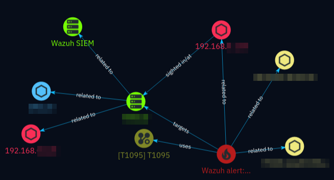
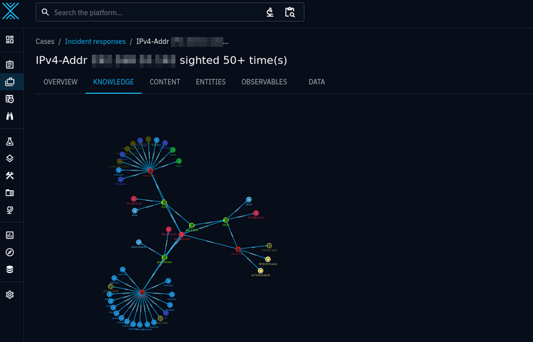

.. _enrichment:

Enrichment
==========

When an entity is found in Wazuh alerts and if the settings call for the
creation of sightings and incidents, the entities specified in
:attr:`enrich.types <wazuh.enrich_config.EnrichmentConfig.types>` will be
created as context, if found in the alerts.

.. figure:: images/incident_1.png

   An incident created based on a sighting of an IPv4 address in a Wazuh agent
   (system)

Examples:

- If :attr:`AttackPattern
  <wazuh.enrich_config.EnrichmentConfig.EntityType.AttackPattern>` is enabled,
  the *rule.mitre* field in alerts will be used to create relationships to
  `MITRE attack patterns <https://attack.mitre.org/>`_. The relationship type
  will be *uses*.
- If :attr:`File <wazuh.enrich_config.EnrichmentConfig.EntityType.File>` is
  enabled, any filename / file path references will result in a File
  :term:`SCO` being created, including an optional parent directory.
- If :attr:`Process <wazuh.enrich_config.EnrichmentConfig.EntityType.Process>`
  is enabled, process :term:`SCOs <SCO>` are created from alerts like those
  coming from sysmon and auditd. Metadata like PID, parent processes, images as
  File SCOs, user accounts and command lines are extracted.

Unless specified otherwise, the relationships between the entities created and
the incident are of type "related-to" (in lack of better standard-conforming
types). Each relationship object contains information about which alert and
which field the entity was created from. You can retrieve this information in
the incident response case *knowledge* view by clicking on the relationship
arrows.

   A simple incident response case with one incident and a few objects and
   relationships

Enriching data from alerts gives the analyst a lot more information to act on
in an incident. Having to create all the individual :term:`SCOs <SCO>` and
relationships would be incredibly time consuming.

   A more complicated incident response case with several incidents and many
   objects and relationships

See the usage section on :ref:`incidents and alerting <incidents>` and
:ref:`case management <case-management>` for more details.

Supported entities
~~~~~~~~~~~~~~~~~~
.. autoclass:: wazuh.enrich_config::EnrichmentConfig.EntityType
   :members:
   :noindex:
