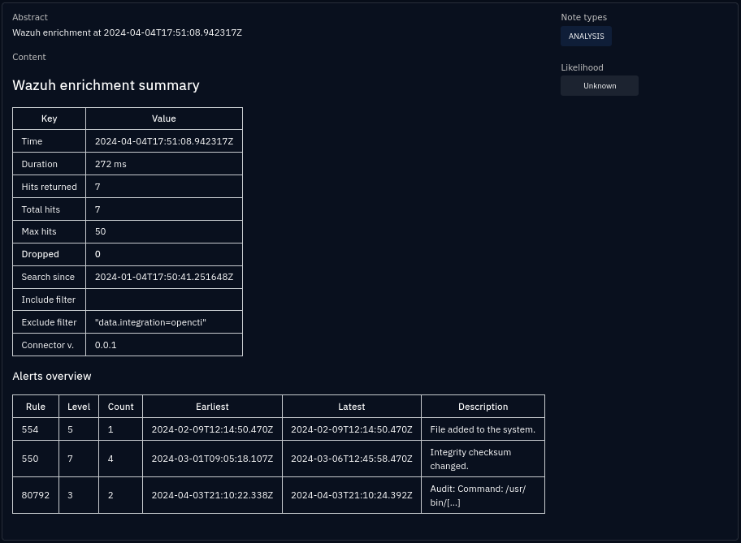
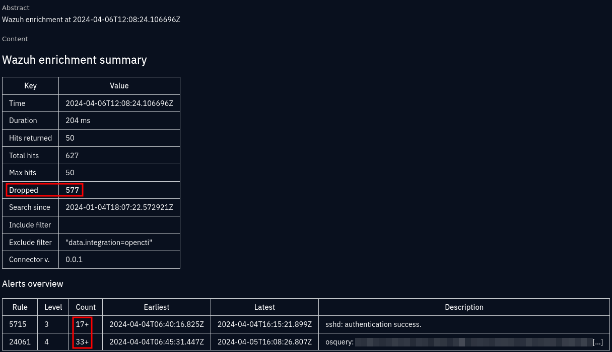

.. _enrichment-note:

Enrichment summary note
===================================================

The following is an example of :octiu:`STIX note <exploring-analysis/#notes>`
that is created and attached to the :octiu:`observable
<exploring-observations/#observables>` that is enriched, and to any created
:octiu:`incidents <exploring-events/#incidents>`

In this example, an enrichment was run on a File observable, searching for a
file name only. The file name was unique, and only a few results were returned.
The highlighted **Dropped: 0** indicates that no results were dropped (because
the limit :py:attr:`~wazuh.config.Config.hits_limit` was met).

The meaning of all the fields in the summary table are as follows:

.. list-table:: Enrichment summary table
   :header-rows: 1

   * - Key
     - Value
   * - Time
     - When the enrichment was run
   * - Duration
     - The duration of the OpenSearch query
   * - Hits returned
     - Number of alerts returned by the query
   * - Total hits
     - The total number of matches
   * - Max hits
     - Maximum number of results to return, as per :py:attr:`~wazuh.config.Config.hits_limit`
   * - Dropped
     - Results dropped (Total hits - Max hits)
   * - Search since
     - Time filter used, as per :py:attr:`~wazuh.config.Config.search_after`
   * - Include filter
     - Additional search filters used, as per :py:attr:`~wazuh.config.Config.search_include`
   * - Exclude filter
     - Additional search filters used, as per :py:attr:`~wazuh.config.Config.search_exclude`
   * - Connector v.
     - The connector version at enrichment time

The next table provides a summary of the alerts found:

.. list-table:: Alerts overview table
   :stub-columns: 1

   * - Rule
     - The alert rule ID, with a link ot the Wazuh instance rule overview
   * - Level
     - The :wazuh:`alert rule level <ruleset/rules-classification.html>`
   * - Count
     - Number of alerts of this rule ID (a **+** indicates an inaccurate number)
   * - Earliest
     - The earliest alert of this rule ID (within the search constraints)
   * - Latest
     - The latest alert of this rule ID (within the search constraints)
   * - Description
     - The alert rule description (shortened to a common prefix string and
       displayed with "[…]" if the alerts with this rule ID had different
       descriptions)

As opposed to the former example, in this run the search was for an IP address
that returned a lot of hits. The limits put in place ensures that not too much
noise is inserted into OpenCTI.

Since the number of alerts per rule ID is misleading when results are dropped,
a **+** is shown in bold next to the alert count in *Alerts overview*.
