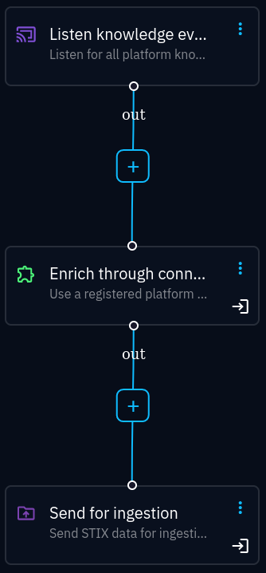

.. _important-settings:

Important settings
~~~~~~~~~~~~~~~~~~

After having configured the required settings, you should at minimum read up on
and adjust the following settings:

TLS verification
----------------

:attr:`opensearch.verify_tls <wazuh.opensearch_config.OpenSearchConfig.verify_tls>`

   Whether the OpenSearch TLS certificate should be verified.

Searching
---------

:attr:`search.limit <wazuh.opensearch_config.OpenSearchConfig.limit>`

   Maximum number of alerts to return from a search.

:attr:`~wazuh.config.Config.hits_abort_limit`

   Number of alert matches (reported by OpenSearch, not the number of results
   returned) that should abort further processing. This limit helps preventing
   flooding OpenCTI with events from bad searches. See also
   :attr:`~wazuh.config.Config.bundle_abort_limit`.

Event creation
--------------

:attr:`~wazuh.config.Config.create_obs_sightings`

   Create sightings for observables that do not have indicators based on them

.. _require-indicator:

:attr:`~wazuh.config.Config.require_indicator_for_incidents`

   By default, incidents (and incident response cases) will only be created if
   observables have indicators based on them. These additional settings are
   used to adjust the indicator requirements:

   - :attr:`~wazuh.config.Config.require_indicator_detection`
   - :attr:`~wazuh.config.Config.ignore_revoked_indicators`
   - :attr:`~wazuh.config.Config.indicator_score_threshold`

:attr:`enrich.types <wazuh.enrich_config.EnrichmentConfig.types>`

   Which entites to create as alert context for incidents. By default, all
   supported entities are enabled, which may be noisy (depending on the alerts
   matched).

.. _when-to-run:

When to run
-----------

The CONNECTOR_AUTO setting can be either true (*auto*) or false (*manual*).
Auto is most likely the most preferred choice. However, it is possible to use
:octiu:`playbooks <automation>` to run :octiu:`enrichments
<automation/?h=enrich#enrich-through-connector>` if you have an OpenCTI
enterprise licence. In the example below, the opencti-wazuh-connector is
configured as *manual*, and called through a playbook. The first block is set
to filter on author, so that the connector will only look up entities from
high-quality data sources:

See `this Filigran blog post
<https://blog.filigran.io/introducing-threat-intelligence-automation-and-playbooks-in-opencti-b9e2f9483aba>`_
for an introduction on playbooks.
