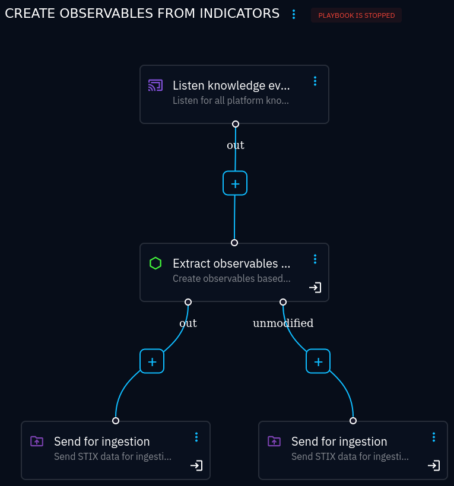
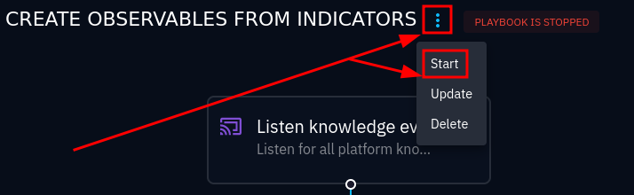

.. _obs-from-inds:

Automatically create observables from indicators
================================================

The OpenCTI :octiu:`rules engine <automation>` (an enterprise licence feature)
can be used to automatically create observables from indicators and then create
relationships that says that the indicator is *based on* those observables.

This is very useful because this connector relies on these relationships for
distinguishing observables (data, not necessarily malicious) from indicators
(malicious data). Without this automation, the connector cannot look up
indicators created without any *based on* relationships (which may be the case
for some data sources).

Creating the automation rule
~~~~~~~~~~~~~~~~~~~~~~~~~~~~

#. Navigate to Data → Processing → Automation
#. Create a playbook and name it something logical, like "Create observables
   from indicators"
#. Click on the new playbook
#. Add a source event (the single choice **Listen knowledge events**):

   .. figure:: images/playbook_2.png

      Create an entrypoint for the playbook by clicking on the grey box (which
      may be very hard to see)

#. Select *create* and *update*, and add a filter for *Entity type = Indicator*

   .. figure:: images/playbook_3.png

      Create a *Listen knowledge events* component that triggers when an
      Indicator is either created or modified

#. Add a new component and select *Extract observables from indicator*

   .. figure:: images/playbook_4.png

   Add new component in *out* of the root component

   .. figure:: images/playbook_5.png

   Select component *Extract observables from indicator*

#. Select *Create observables from all indicators in the bundle*
#. For both outputs, *out* and *unmodified*, add a *Send for ingestion* component

The resulting playbook should look like this:

   Final playbook for creating observables from indicators

Finally, start the playbook:

   Starting the playbook

The status and results can be monitored by clicking on the button in the
upper-right corner.
