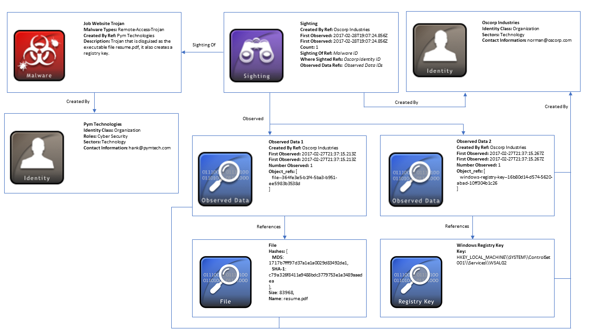
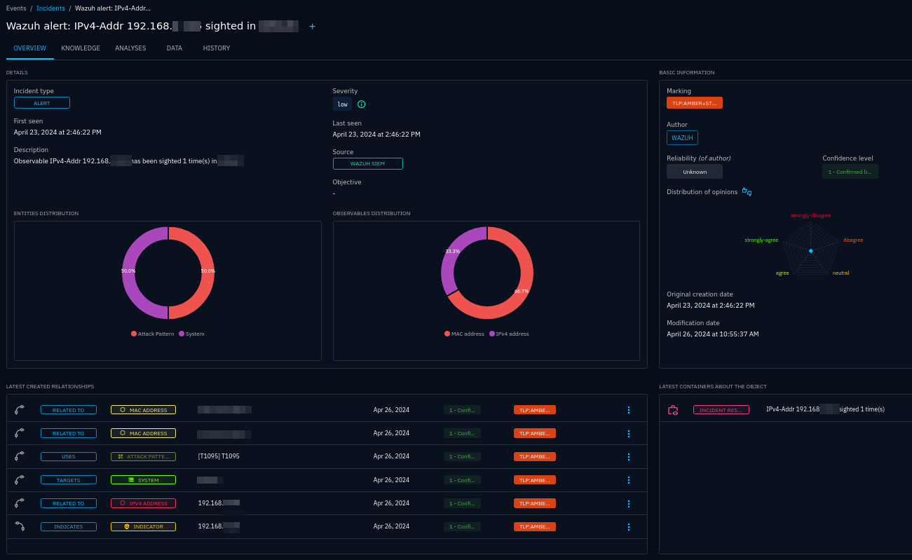
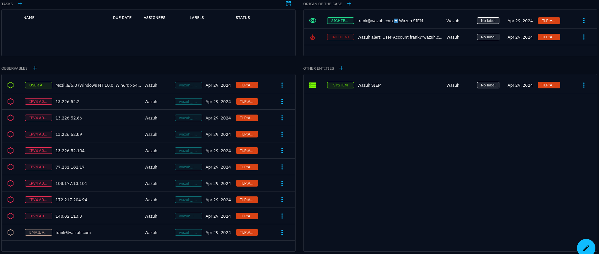
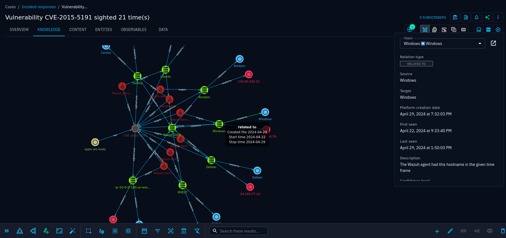
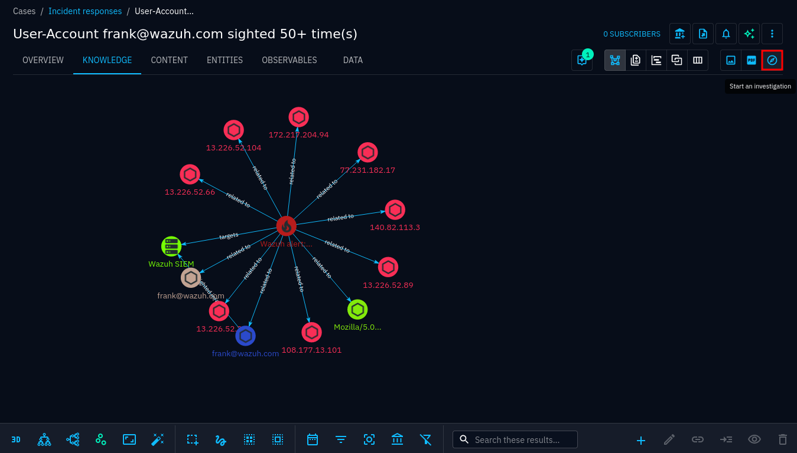
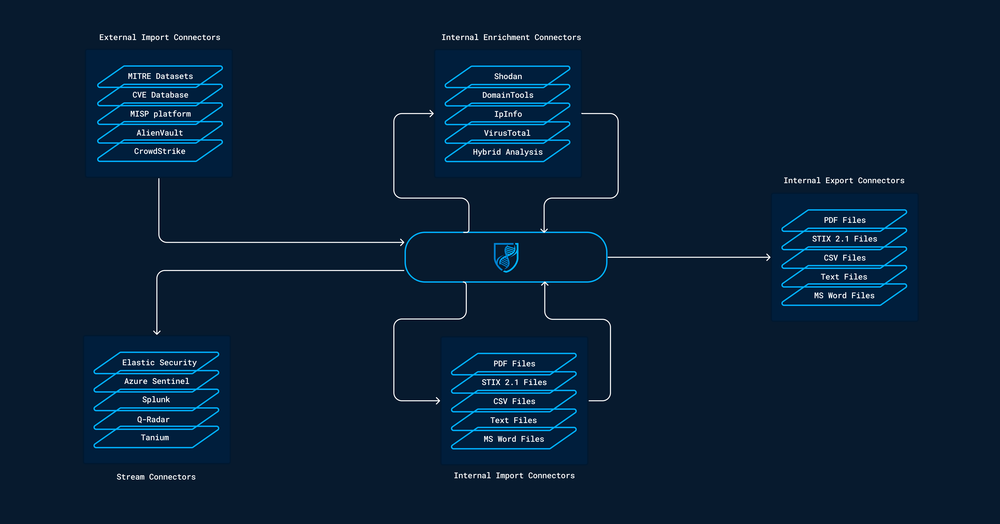

.. _opencti:

OpenCTI
=======

OpenCTI, short for Open Cyber Threat Intelligence Platform, is an open-source
software project designed for managing and sharing cyber threat intelligence
(:term:`CTI`). For organisations that are not heavily involved in CTI, it is
still a useful as a local threat database. It can be fed from many intelligence
sources, paid and free/open, and then be used for intensive lookups internally
without having to worry about :term:`API` limits and leaking data outside of
the organisation.

OpenCTI's :octiu:`own documentation <getting-started>` is well worth a read in
order to get familiar with the platform. This connector documentation will not
go into detail about how OpenCTI works, how to set it up or how to use it.
However, it will attempt to introduce new (Wazuh) users to OpenCTI and briefly
describe important concepts of the platform.

See the :ref:`Usage chapter <usage>` for how OpenCTI is expected to be used
along with Wazuh and this connector.

Threat intelligence
~~~~~~~~~~~~~~~~~~~

In the world of cyber security, indicators of compromise (:term:`IoCs <IoC>`)
quickly go out of date, especially when it comes to IP addresses, domains,
URLs, but also file hashes. There is barely any point trying to keep Wazuh
rules up to date with the latest threat intelligence. A much better approach is
using a dedicated tool, like OpenCTI, to maintain CTI, and look up IoCs as they
are published in all of Wazuh. This is exactly what this connector does, in
addition to providing helpful case management when IoCs are found.

In order to fill the database with threat intel, you would typically set up
:octid:`connectors <connectors>` to automatically import data from a number of
sources. OpenCTI provides an :octigh:`impressive amount of connectors
<connectors>`. You can of course also import or create data manually.

The Wazuh integration `wazuh-opencti <https://github.com/misje/wazuh-opencti>`_
performs similar lookups the other way around: Looking up Wazuh alerts in
OpenCTI as the alerts are created.

STIX
~~~~

:term:`STIX` is a language and serialisation format used extensively in CTI to
describe and share threat information. This documentation will provide a lot of
links to the :stix:`STIX standard <>`, but you need not know anything about it.
If you are curious about STIX, start with the `official STIX introduction
<https://oasis-open.github.io/cti-documentation/stix/intro>`_ instead of the
standard reference.

.. _observable:

Observables
~~~~~~~~~~~

Observables, commonly referred to as :term:`SCOs <SCO>` (:term:`STIX` cyber
observables) are immutable objects, such as an IPv4 address, MAC address,
domain name, URL, user account etc. They do not inherently imply malicious
content, but serve as raw data points, used to indicate that something was
observed somewhere, or to provide useful context in a :ref:`knowledge graph
<knowledge-graph>`. When data is considered malicious, :ref:`indicators
<indicator>` are used to describe them, typically with a reference to the
observable.

Domain objects
~~~~~~~~~~~~~~

Domain objects, commonly referred to as :term:`SDOs <SDO>`, are most
:term:`STIX` objects that are not observables: attack patterns, identities,
incidents, locations, malware, reports, tools, vulnerabilities etc.

.. _indicator:

Indicators
----------

:octiu:`Indicators <exploring-observations/?h=indicator#indicators>` are
detection objects, defined by search patterns, such as :stix:`STIX
<#_e8slinrhxcc9>`, `yara <https://virustotal.github.io/yara/>`_ and `Sigma
<https://sigmahq.io/>`_, just to mention a few. There is unfortunately no
support yet in this connector for looking up indicators directly using
patterns, but this is on the :github:`roadmap <issues/9>`. In the meantime,
indicators are used indirectly, which will be explained shortly.

Some threat intel sources provide indicators on their own, whereas many provide
indicators with links to the observables that make up the indicator, e.g.:

   Indicator("[ipv4-addr:value = '10.20.30.40']") – based-on –> Observable("ipv4-addr", "10.20.30.40")

This relationship is used by this connector in lieu of direct indicator
support. If an observable is found in Wazuh, and an indicator is linked to that
observable, an incident can be created.

Identities
----------

Identities are used by this connector to refer to :ref:`Wazuh agents <agent>`.
Agents are automatically created as identities of type :octiu:`system
<exploring-entities/?h=system#systems>`.

These systems are referred to in :ref:`sightings <sighting>` and :ref:`incidents <incident>`:

- SCOs are *sighted* in an agent
- Incidents *targets* agents

Events and relationships
~~~~~~~~~~~~~~~~~~~~~~~~

OpenCTI categorieses the following :term:`SDOs <SDO>` and :term:`SROs <SRO>`
(relationships) as :octiu:`events <exploring-events>`:

- :ref:`Incidents <incident>`
- :ref:`Sightings <sighting>`
- Observed data

The former will be described shortly. Observed data correspond to an extract
from a log that contains observables. This sounds like a perfect fit for a
connector like opencti-wazuh-connector, but this object is not used at all.
Observed data is implemented in OpenCTI just for STIX compliance reasons, and
is seemingly not used. In STIX, a sighting is supposed to be of an indicator,
with another reference to observed data (see the figure below). In OpenCTI,
sightings are instead created directly against observables or indicators.

   Illustration of a sighting (from `Introduction to STIX
   <https://oasis-open.github.io/cti-documentation/examples/sighting-of-observed-data>`_)

.. _sighting:

Sighting
--------

A sighting is a relationship (:term:`SRO`) that tells us that an observable is
detected by or within an information system, an individual or an organisation.
The targeted entities used by this connector are systems, either Wazuh itself
or its agents.

Sightings contain the following information:

- First seen
- Last seen
- Count

This lets a single sighting object between an observable and a system cover
all sightings. If a new sighting is uploaded to OpenCTI, it will extend the
first/last seen range and increment count.

.. _incident:

Incident
--------

:octiu:`Incidents <exploring-events/?h=incide#incidents>` usually represent
negative events, and are used by this connector when an :term:`IoC`, rather
than just an observable, is detected. That is, when an observable is sighted,
and that observable is part of an indicator.

Incidents also come with more information that just a sighting. The connector
will :ref:`enrich <enrichment>` alerts, i.e. create observables and other
entities as context, and link them to the incident.

   An incident created based on a sighting of an IPv4 address in a Wazuh agent

:octiu:`Notifications <notifications>` may also be created using triggers, so
that a :term:`SOC` can act on the incident immediately (possibly by using
OpenCTI's own :ref:`case management system <ir-case>`).

Containers
~~~~~~~~~~

.. _ir-case:

Incident response case
----------------------

   Incident response case overview

OpenCTI provides a :octiu:`case management system <exploring-cases>`, which
comes in handy when observables, identities, sightings, incidents, along with
other information, such as vulnerabilities, tools, malware, :term:`TTPs <TTP>`
and threat actor lists, are all in the same platform.

When incidents occur, an incident response case is created for those incidents.
Out of the box, cases may seem a bit empty, but they first need to be
customised to your needs using :octia:`status templates
<ontologies/?h=status+te#status-templates>` and :octia:`case templates
<ontologies/?h=case+temp#case-templates>`. See :ref:`case management
<case-management>` in the :ref:`usage` chapter for more details.

.. _knowledge-graph:

Knowledge graph
^^^^^^^^^^^^^^^

The knowledge graph is a central component of OpenCTI, visualising entities and
their relationships in a graph. The graph can be further expanded and modified
by starting an :ref:`investigation <investigation>`.

.. _investigation:

Investigation
~~~~~~~~~~~~~

An :octiu:`investigation <pivoting/?h=investigation>` is an interactive
interface where you can manipulate a knowledge graph. Investigations can be
created from scratch or by copying the knowledge graph from a case:

   Create an investigation from a case

Investigations are private and only available to you unless you share them, or
later publish them in reports or export them as a PDF. In an investigation,
objects can be added or removed from the graph, relationships can be created,
removed or included. As more and more nodes appear, the investigation can pivot
on new objects. See :ref:`case management <case-management>` in the
:ref:`usage` chapter for more information.

Connector
~~~~~~~~~

   List of selected connectors and how they are categorised (from the
   :octid:`OpenCTI documentation <connectors>`)

:octid:`Connectors <connectors>` are ways for OpenCTI to ingest, enrich and
export data. The five types of connectors are

- External import
- Internal enrichment (this is what opencti-wazuh-connector is)
- Internal export
- Internal import
- Stream

Typical use cases for connectors are to ingest data from sources like
CrowdStrike, AlienVault and MITRE, and enrich data through services like
Shodan, IpInfo, VirusTotal and Hybrid Analysis.

Other :term:`SIEMs <SIEM>` are typically implemented as *stream* connectors,
whereas this connector is an *enrichment* connector. This is because Wazuh does
not stream data to OpenCTI. OpenCTI is the one looking up new data in Wazuh,
not the other way around. For this, the enrichment interface is more suitable.

There is clearly a missing piece in this integration, and that is looking up
new alerts in Wazuh in OpenCTI. This is on the :ref:`roadmap <roadmap>`.

If you are new to OpenCTI and want some help on finding useful connectors (free
of charge), look at :ref:`this overview <connector-list>`.

.. toctree::
   :hidden:
   :maxdepth: 2

   connector-list
