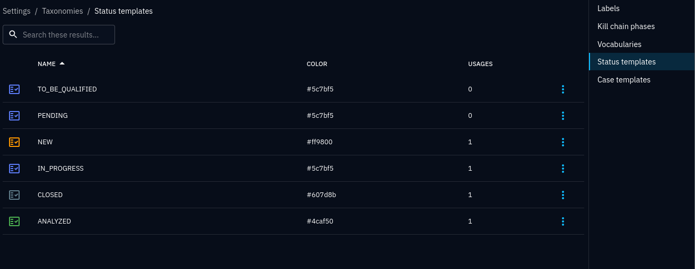
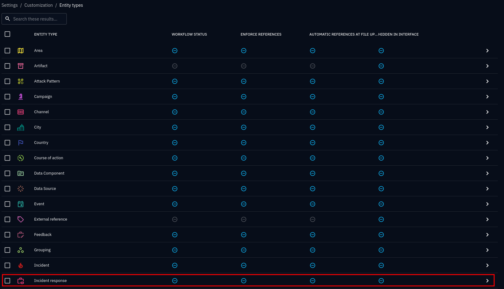
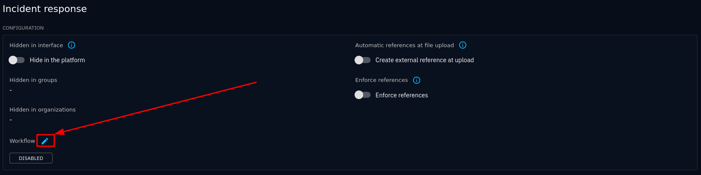
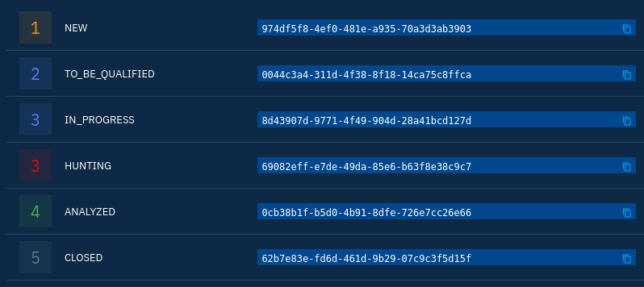
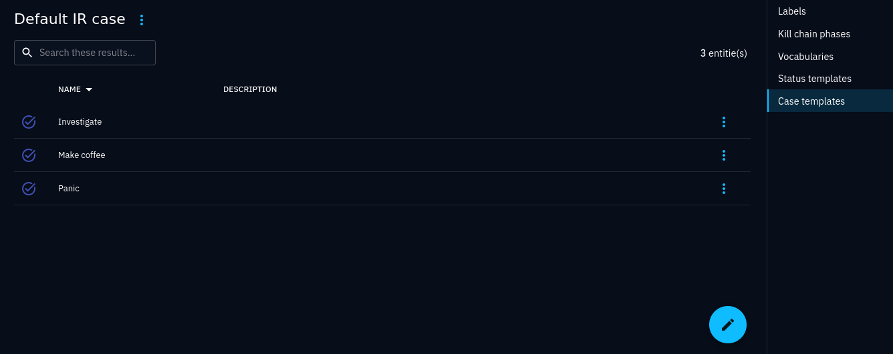
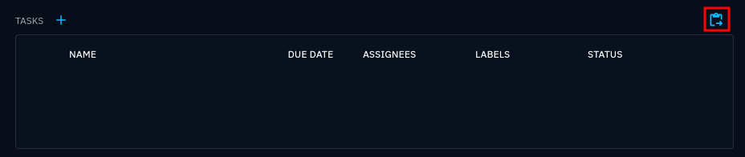
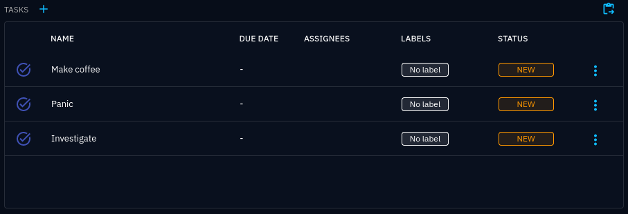

.. _opencti-configuration:

OpenCTI configuration
~~~~~~~~~~~~~~~~~~~~~

This section provides some useful hints on how to configure OpenCTI for
connecting to Wazuh. Please refer to the :octid:`OpenCTI documentation
<overview>` for more details.

TODO: alerting

.. _status-templates:

Status templates
----------------

:octia:`Status templates <ontologies/?h=status+templates#status-templates>`
are used to assign statuses on reports, tasks, incidents and cases, typically
used to track progress. They are not assigned directly, but used as individual
states as part of :ref:`workflows <workflows>`. Status templates are shared
between workflows and can be created either under Settings → Taxonomies →
Status templates, or directly in the workflow editor.

OpenCTI provides the following default status templates:

   OpenCTI status template overview with default status templates

.. _workflows:

Workflows
---------

Although OpenCTI provides default status templates, there are no default
:octia:`workflows <entities/?h=workflow#workflow>` for most relevant entities.
Workflows are needed to set statuses on reports, tasks, incidents and cases.

Workflows are configured under Settings → Customization → <entity type> →
Workflow:

   Customising the entity *Incident response*

   Modifying workflows for *Incident response*

Workflows are defined with status templates in a logic order, like *New* → *In
progress* → *Closed*. Different types of entities may warrant different
workflows. Note that it is possible to have several alternatives to a workflow
stage by assigning a status label to the same index. In the following example,
the state following *TO_BE_QUALIFIED* can be either *IN_PROGRESS* or *HUNTING*:

   Example workflow for *Incident response*

.. _case-templates:

Case templates
--------------

Case templates lets you conveniently assign a set of default tasks on a case. They are configured under Settings → Taxonomies → Case templates.

.. figure:: images/case_templates_1.png

   Creating a new case template by adding tasks

   Case template task list

The connector will not use any case template when creating incident response
cases, but case templates can easily be applied by using the *Apply a new case
template* button in the tasks section:

   Applying case template to a new case

   Tasks created by applying a case template
