.. _usage:

Usage
=====

Unless you are familiar with OpenCTI, you should read the :ref:`introduction to
OpenCTI <opencti>` first.

This chapter assumes that you have

#. :ref:`Installed the connector<installation>` and set up users and tokens
#. :ref:`Configured <config>` the connector
#. (A populated Wazuh database, either with real [#f1]_ or simualted data,
   if you intend test the setup as you read along)

In order to use the connector, you need to call it through OpenCTI's
:octiu:`enrichment <enrichment>` action. This is an operation that can be
performed on all observables, as well as some other entities, like
vulnerabilities.

First of all, how you use the connector depends on how you have set it up to
trigger. See :ref:`when to run <when-to-run>`. In most cases, you would want
the connector to run automatically, either on all data, or on filtered data,
using :octiu:`playbooks <automation>`. You can always run the connector
manually by pressing the *enrich button*:

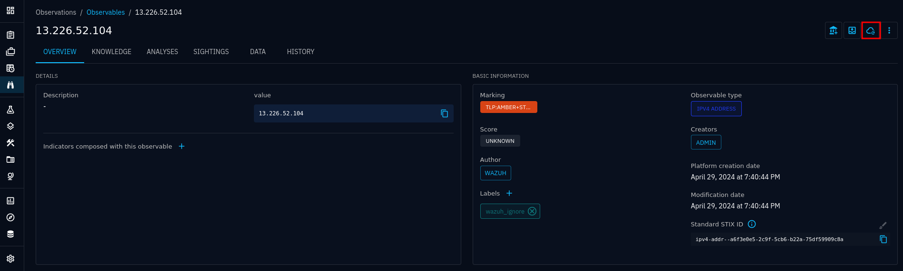

   Observable with enrich button highlighted

For :term:`SDOs <SDO>`, the enrich button is typically a bit more hidden:

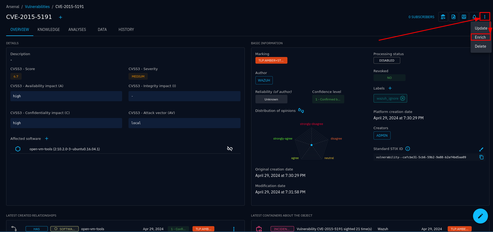

   Vulnerability with enrichment button hidden under the "kebab" menu

.. note::

   The connector will only show up as an enrichment option if CONNECTOR_SCOPE
   includes the entity in question.

When the enrich button is clicked, the connector will start searching for the
entity in Wazuh.

Aborted searches or no hits
~~~~~~~~~~~~~~~~~~~~~~~~~~~

If the connector returns no results, but completes with a green status, the
explanation is simply that there are not hits. If you expected results, please
have a look at the :ref:`troubleshooting section <troubleshooting>`.

If the enrichment resulted in a red status icon, something failed. Common causes are:

- Network issues
- Authentication issues (is the :attr:`search.username
  <wazuh.opensearch_config.OpenSearchConfig.username>` and
  :attr:`search.password <wazuh.opensearch_config.OpenSearchConfig.password>`
  correct, and does the user have the :ref:`correct permissions
  <create-opensearch-user>`?)
- The query fails because there are too many hits

See the :ref:`troubleshooting section <troubleshooting>` for details.

Navigating the results
~~~~~~~~~~~~~~~~~~~~~~

When the enrichment has completed and you have got hits, refresh the page to
start seeing results. First of all, you should see results in the *sightings*
tab:

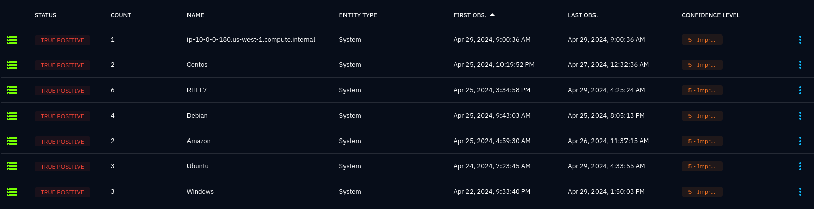

   List of sightings of an entity

Each sighting will tell you about when the entity was first observed in a
system, when it was last seen, and the number of times it was seen in this time
span. For every new sighting of the same entity in the same system, the
timestamps and count will be updated accordingly. Never use this information as
a definite source of truth, especially because search results may be capped by
:attr:`search.limit <wazuh.opensearch_config.OpenSearchConfig.limit>`. More on
this later.

Clicking on a sighting (which is relationship) will bring you to the
relationship view. If you click on the system, you'll navigate to the system
view, where you can find other sightings in that system, as well as other
related entities and relationships, like incidents, incident response cases and
inferred relationships to other entities. 

.. _notes:

Notes and references
~~~~~~~~~~~~~~~~~~~~

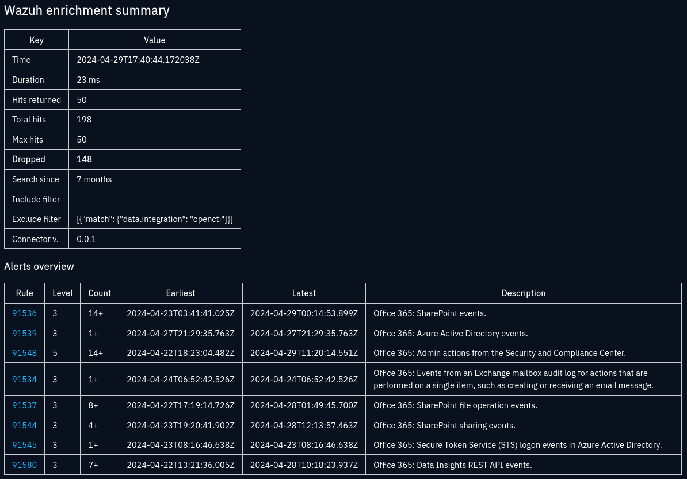

   Enrichment summary note for a User-Account observable

As long as :attr:`~wazuh.config.Config.create_sighting_summary` is enabled, a
:octiu:`note <exploring-analysis/?h=note#notes>` will be created and attached
to the observable and each sighting. This summary gives you details about the
search results and matched alerts, along with how the results were possibly
limited. See :ref:`example summary note <enrichment-note>` for details.

.. toctree::
   :hidden:
   :maxdepth: 2

   example_summary_note

In addition, a note will be created for every matched alert, limited by two
settings in order to avoid too many notes:

- :attr:`~wazuh.config.Config.max_notes`
- :attr:`~wazuh.config.Config.max_notes_per_alert_rule`

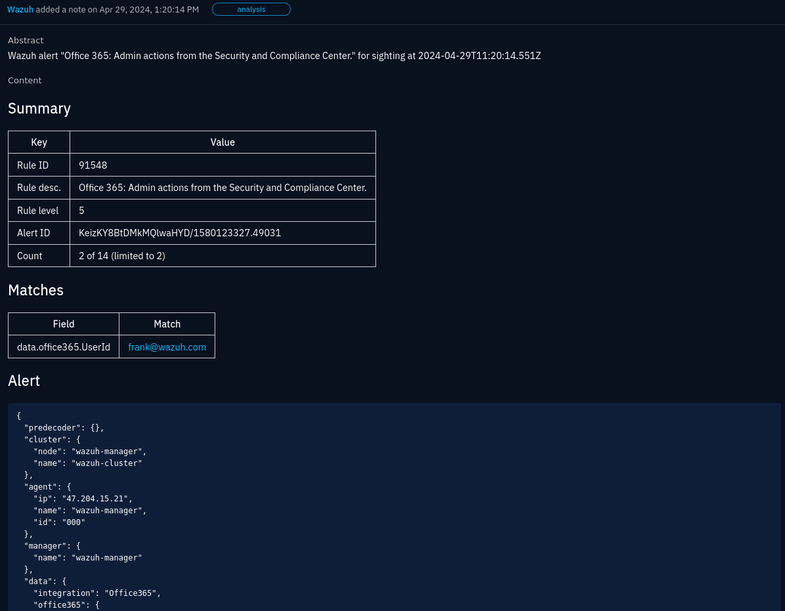

   Alert note for an Office 365 admin action event where the User Account
   observable was found in the *UserId* field.

The alert note gives you a summary about the alert, along with the whole alert
as JSON. A table provides a simple overview of where the observable matched in
the alert. **This is not how matching works when searching for alerts**. It's
just a simple substring match in the result for convenience. It may be empty
if this simple approach does not return any results.

In addition to notes, a link in form of an external reference is also attached
to the observable and sightings. The link will take you to to the alert in
Wazuh. How many links to create are controlled by settings very similar to
those for alerts.

.. _incidents:

Incidents and alerting
~~~~~~~~~~~~~~~~~~~~~~

A sighting just tells you that an observable is found in Wazuh, when and how
often. It does not necessarily indicate anything malicious. However, if that
observable is part of an indicator, an incident may be created as well. See
:ref:`require indicator <require-indicator>` for an overview of which settings
determine when an incident should be created.

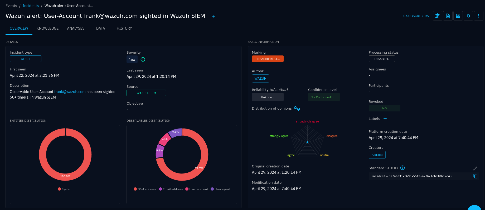

   Incident view

When the connector creates an incident, it will include a lot of entities that
are related to the matched alerts. These are extracted in the connector stage
called :ref:`enrichment <enrichment>` (not to be confused with the *OpenCTI
enrichment*, which is the action that runs the connector in the first place).
The relevance of these entities may vary a lot, but they are all preset in the
alerts that caused the incidents. You may configure which kind of entities to
include by changing :attr:`enrich.types
<wazuh.enrich_config.EnrichmentConfig.types>`.

In lack of more suitable standards-compatible relationship types, most
relationships are simply "related-to".

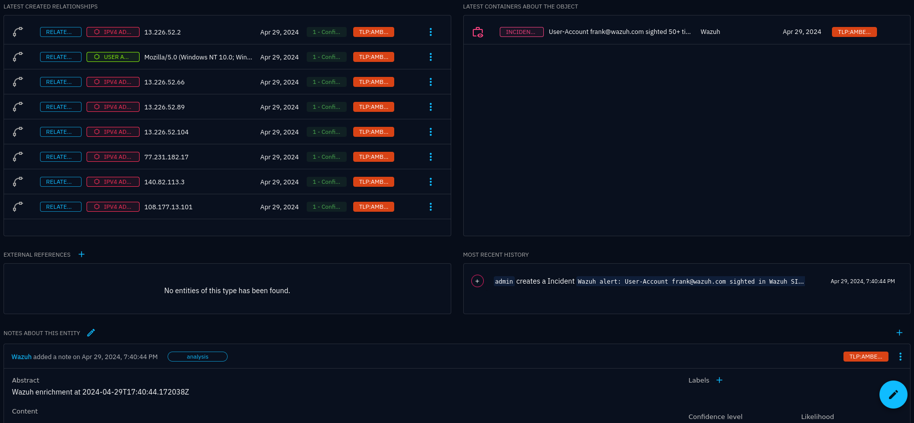

   Incident view (continued)

Alerting
--------

Just as you would set up some form of notification, like e-mail or Slack, for
high-level alerts in Wazuh, you probably want to be notified when incidents are
created in OpenCTI. OpenCTI offers a powerful trigger system where you can
create triggers on creation/modification/deletion of any kind of entity, with
optional filters. You can also create triggers on specific objects.

Triggers are typically created individually, but you may also create and apply
them for groups or organisations as an administrator.

See the OpenCTI documentation on :octiu:`notifications <notifications>` for
details. Below is an example of creating a trigger on incidents and (incident
response) cases:

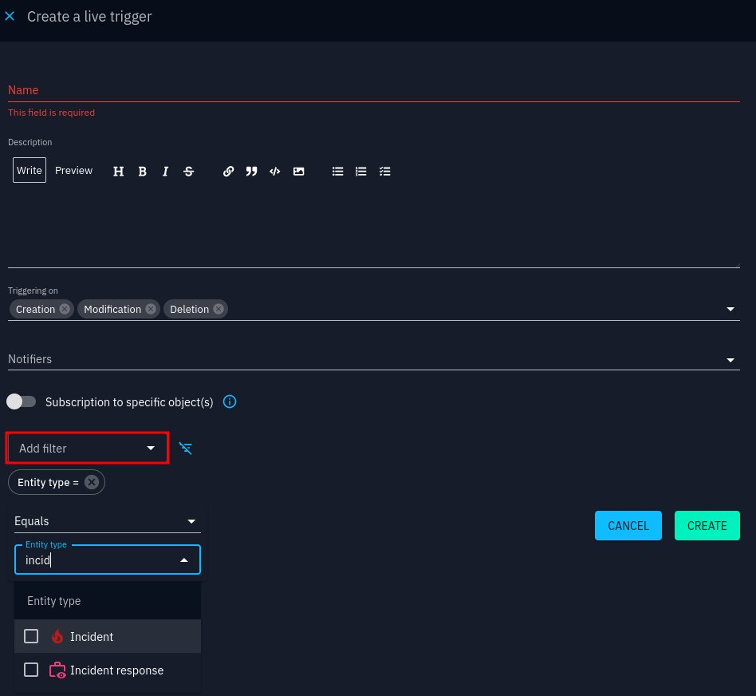

   Trigger interface

By default, only e-mail is available as a notifier. See the :octia:`OpenCTI
administration documentation <notifiers>` for how to configure notifiers.

.. _case-management:

Case management
~~~~~~~~~~~~~~~

Incident response cases are one of several :octiu:`cases <exploring-cases>` in
OpenCTI. Cases are an extension to :term:`STIX` that brings case management to
OpenCTI.

Before using case managemnt, be sure to configure :ref:`status templates
<status-templates>` and :ref:`workflows <workflows>` in your OpenCTI
installation, as well as :ref:`case templates <case-templates>`. Otherwise,
cases and tasks will not be very useful. You may set these up after having
created incidents/cases and then use statuses and workflows.

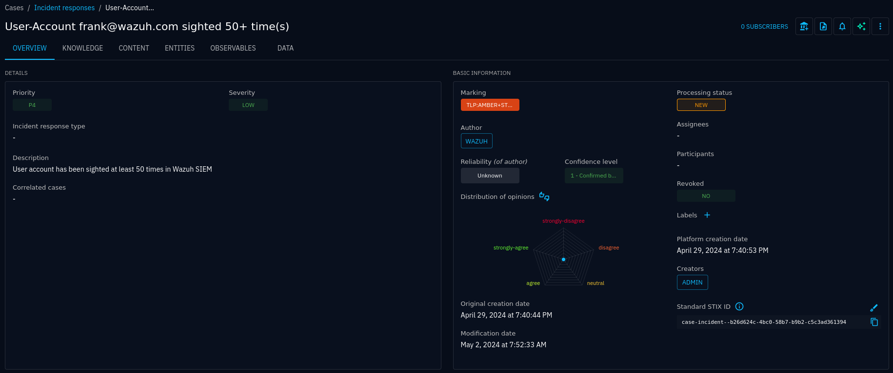

   A new incident response case without any status, assignees, participants or
   tasks

Unless you have configured workflows, your case will have processing set to
*Disabled*. Otherwise, you would have a status label like *New*. Your next
steps would typically be to assign an investigator, possibly assign other
participants, and create a set of default tasks from a case template.

Using a case template is done by clicking on the *Apply a new case template*
button in the tasks section:

.. figure:: images/apply_case_template_1.png

   Applying case template to a new case

.. figure:: images/tasks_1.png

   Tasks created by applying a case template

Investigations
--------------

Investigations turn the knowledge graph view of a case into an interactive
editor where you can pivot on entities, show and hide relationships and other
entities. You may also manually add new entities and create new relationships.
Using the case as a starting point saves you a lot of work compared to
starting an investigation from scratch. Press the *Start an investigaton*
button in the upper-right corner:

.. figure:: images/investigation_1.png

   Start an investigation from a case

The resulting investigaton is yours only, completely private unless you
explicitly share it with team members.

Clicking on entities gives you information about the selected entity, and
likewise for relationships. **Double-clicking** on an entity brings up an
interface for *expanding elements*:

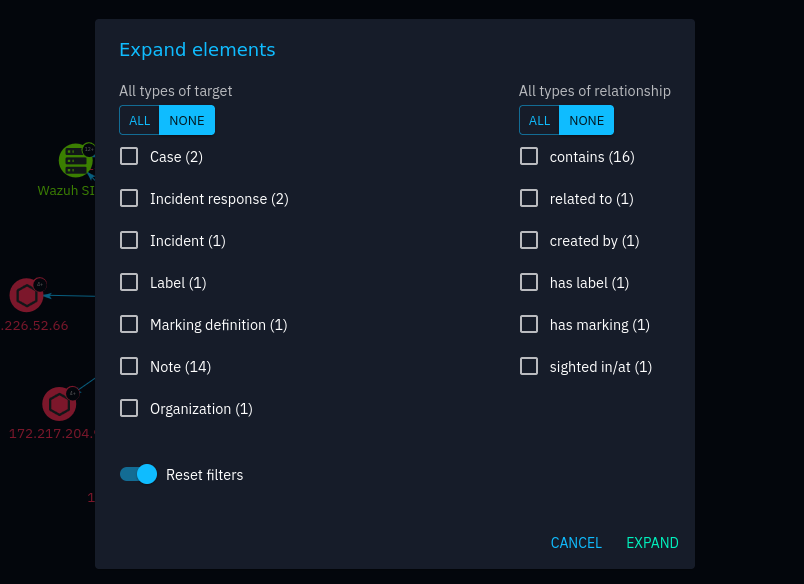

   Expand nested entities, relationships and related entities

When you have a knowledge graph that you would like to use in a report, you
can create a report from your investigation by clickon on the *Add to a
container button*:

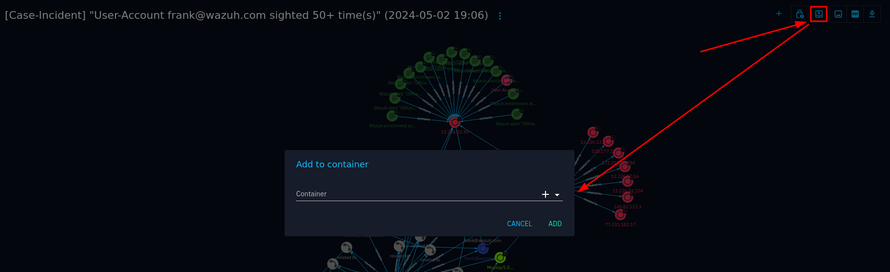

Examples
~~~~~~~~

TODO: Concrete example from IoC to report

.. [#f1]

   Beware that looking up real data in your :term:`SIEM` may require you to
   follow laws and procedures, like :term:`GDPR`, depending on your location
